# State of Progress

---
## Objectivo:

Este documento tiene la intención de presentar el estado de avance del prototipo dispositivo amplificador y detector de ADN portátil. Junto con ello se muestra todo lo necesario para poder replicar el actual prototipo o también, no necesariamente replicarlo, sino que se puede retomar el proyecto desde este estado para poder mejorar o agregar funcionalidades.

---
## Entregables:

Los entregables se descomponen en dos elementos: Hardware y Software.

### Hardware:

El prototipo físico a la fecha corresponde a la utilización de un dispositivo Ninja-PCR para la parte del encapsulado. Dentro de esta caja se dispone toda toda la electrónica diseñada y el nuevo sistema que interactúa con las muestras.
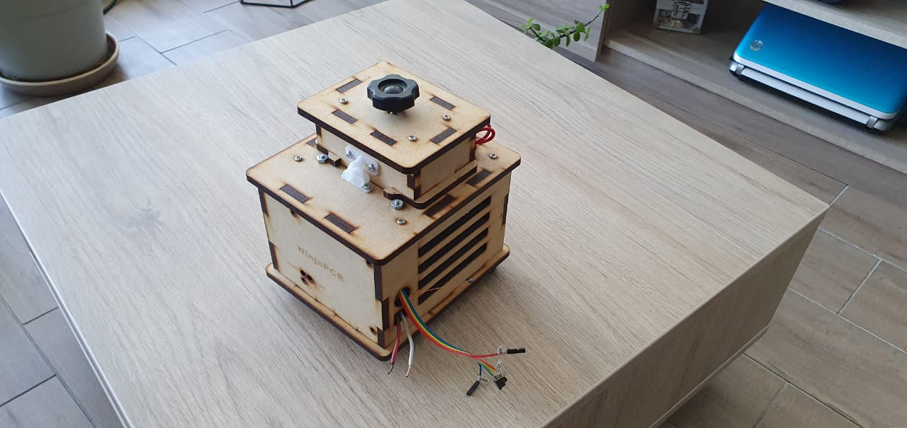

### Software:

Todo el código, tanto de la programación del microcontrolador como de la aplicación de smart-phone, se encuentra en el archivo comprimido “portable_dna_amplifier_detector.rar”.
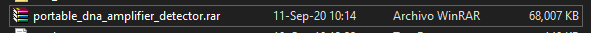

---
## Interacción con el hardware

Para que un usuario pueda utilizar el prototipo físico, tiene que tener en consideración los siguientes aspectos: 1) disposición de muestras a procesar, 2) alimentación de la electrónica, 3) programación del microcontrolador y 4) uso de la aplicación de android.

### 1) Disposición de las muestras a procesar

Se pueden procesar hasta 3 muestras en el actual prototipo las cuales se pueden disponer en 3 orificios realizados en el bloque de aluminio. Existe un cuarto orificio el cual está reservado para disponer un termistor que obtiene una temperatura representativa de las muestras. Notar que en la tapa del prototipo se dispone de un calentador que al cerrarla calienta las tapas de los tubos de ensayo. Lo recomendable es que existan en total 4 tubos de ensayo (3 con muestras a procesar y 1 con el termistor) dado que al cerrar la tapa se debe ajustar con la perilla el apriete de los tubos.
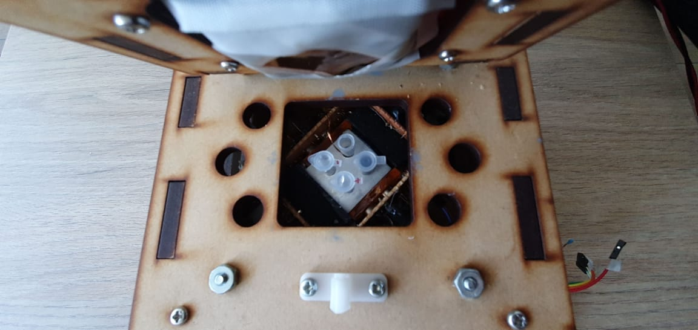

### 2) Alimentación de la electrónica

Se debe alimentar con 5V. Se recomienda que el adaptador a utilizar pueda soportar una corriente máxima de 3A dado que el prototipo consume alrededor de 2.8A a máxima capacidad. Por el momento, es aconsejable utilizar una fuente de laboratorio por dos motivos: para testear la corriente consumida y para garantizar la correcta alimentación (adaptadores de 5V en el mercado generalmente pueden entregar hasta 2A)
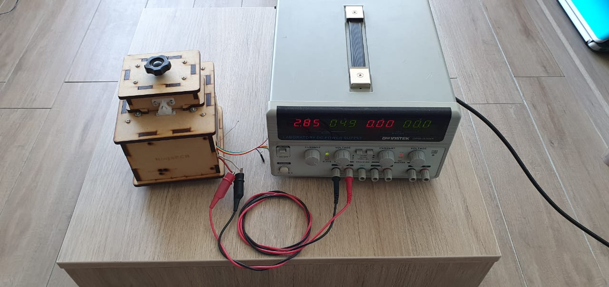

### 3) Programación del microcontrolador

Esta parte no es necesaria a nivel de usuario, más bien es para un desarrollador que necesite modificar el firmware del microcontrolador. Se disponen de un total de 5 cables con conectores hembra para poder programar el microcontrolador.
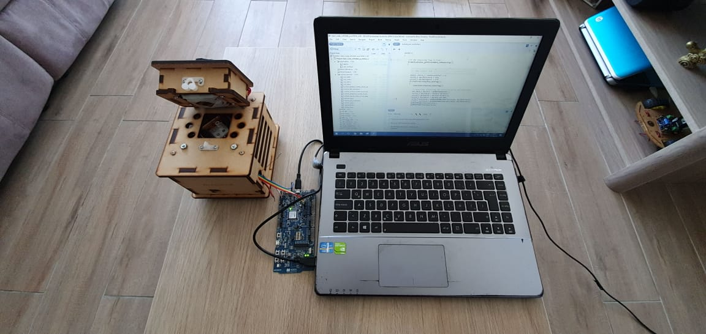

### 4) Uso de la aplicación de Android: 

Para poder utilizar el prototipo se requiere instalar una aplicación de Android diseñada para este propósito. La aplicación se conecta vía BLE con el dispositivo físico y permite definir el tiempo total del proceso. Las temperaturas de referencia del proceso tanto para las muestras como para del bloque de aluminio están seteadas internamente en 67°C (820ADC) y 80°C (870ADC). En la interfaz de usuario se puede ver en tiempo real el estado del proceso: estado de las baterías, estado del sistema de control de temperatura y estado del sistema de detección de fluorescencia. La aplicación guarda archivos .csv para que el usuario pueda postprocesar los datos.
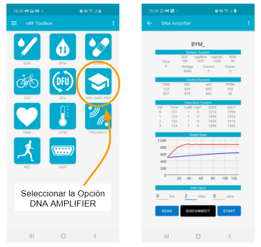

---
## Conexiones para programar el Microcontrolador:

Para un desarrollador es necesario poder actualizar el firmware del microcontrolador. Esto es un proceso que requiere de: un computador que tenga un programa para poder subir el firmware (se utiliza Segger Embedded Studio SES software como ambiente de desarrollo para flashear el microcontrolador), también se requiere de un elemento intermedio de hardware programador-flasheador que permita interfacear entre el microcontrolador y el computador al subir un programa (se utiliza el mismo programador embebido en la tarjeta de desarrollo de nordic nRF52840-DK) y finalmente acceso a los pines del microcontrolador para poder flashear el firmware (del microcontrolador usado es un nRF52840 que está embebido en un módulo Feather de Adafruit).

La conexión entre la tarjeta de desarrollo nRF52840-DK y el computador es mediante un típico conector USB a micro-USB. Las conecciones entre la tarjeta de desarrollo nRF52840 y los cables del prototipo se muestran a continuación:

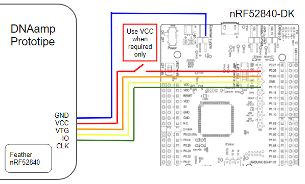
  
Notar que el conector VCC sólo se debe conectar cuando el prototipo no tiene otra fuente de alimentación que lo mantenga encendido. Así, si el prototipo está alimentado con los 5V de una fuente de laboratorio como se muestra en una imágen anterior, sólo se deben conectar los pines GND, VTG, IO y CLK. En caso de que el prototipo no esté alimentado con 5V, se necesita conectar VCC para que la tarjeta de desarrollo brinde la alimentación para encender al microcontrolador durante la programación.

---
## Interacción con el Software:

Para que un desarrollador pueda modificar tanto el código del firmware del microcontrolador como el código de la aplicación de Android se dispone del archivo comprimido “portable_dna_amplifier_detector.rar”. 

Una vez descargado el archivo comprimido, lo recomendable es descomprimirlo dentro del directorio donde está instalado el Software Development Kit SDK de Nordic, ya que cuando se compila el código fuente del firmware se hacen llamados a archivos que están dentro del SDK. Así, lo primero que se debe hacer es instalar el SDK (se utiliza la versión 16.0.0):
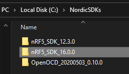

Luego, en el directorio nRF5_SDK_16.0.0 > examples se recomienda descomprimir el archivo “portable_dna_amplifier_detector.rar” como se muestra a continuación:
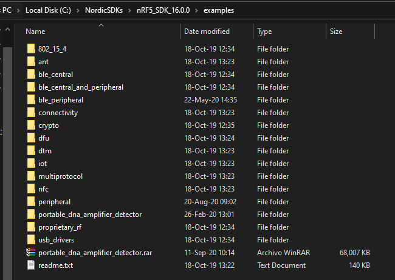

Dentro de la carpeta “portable_dna_amplifier_detector” se pueden ver los siguientes archivos:
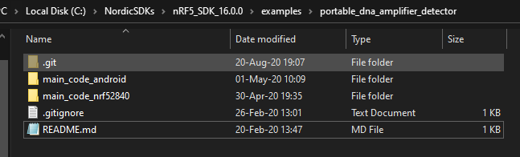

Como se puede apreciar, la carpeta está asociada a un proyecto “git” que tiene una serie de “commits” en la que un desarrollador puede evaluar la evolución del código de programación:

En el proyecto se destacan dos carpetas:
* main_code_nrf52840
* main_code_android

Que corresponden a directorios donde se localizan los códigos de fuente del firmware del microcontrolador y de la aplicación de android respectivamente.

Para modificar el código del microcontrolador se utiliza Segger Embedded Studio SES, por lo que se recomienda instalarlo. Para abrir el proyecto simplemente se debe ir al subdirectorio que se muestra a continuación y hacer doble click en el archivo “.emProject”:
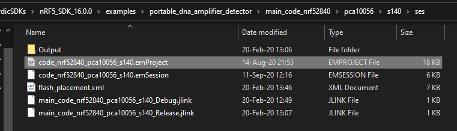
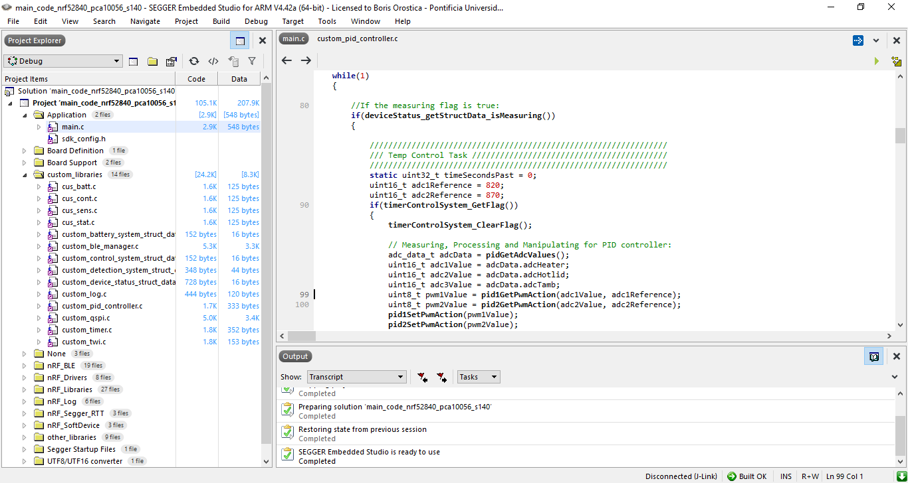

Para modificar el código de la aplicación de celular se utiliza Android Studio, por lo que se debe instalar dicho programa. Para abrir el proyecto de android simplemente se debe seleccionar la carpeta “main_code_android” cuando se abra Android Studio:
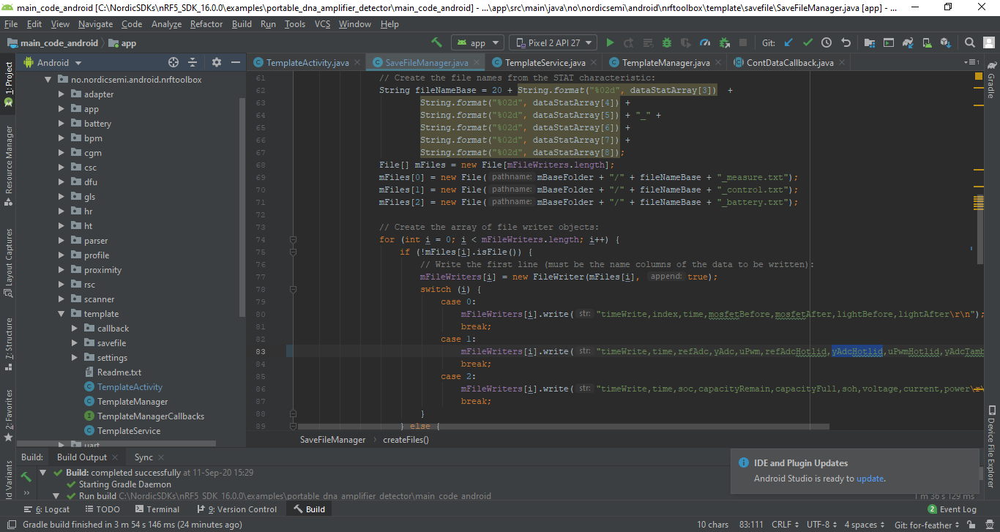

---
## Diseño del Hardware Montaje

A continuación se muestra el proceso de montaje del prototipo:

1. El bloque de aluminio que tiene 4 orificios superiores para disponer de las muestras y 8 orificios laterales: 4 para emitir luz LED y 4 para recepcionar fluorescencia, se fija a un trozo de madera con pernos:
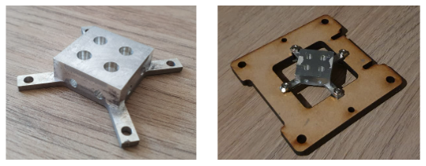

2. Se fabrican 4 placas electrónicas: 2 placas para un total de 4 emisores LED y 2 placas adicionales para un total de 4 fotodetectores. Estas placas se disponen alrededor del bloque de aluminio. Entre el bloque de aluminio y las placas se deben poner los filtros ópticos 4 filtros ópticos: 2 azules para la emisión LED y 2 ámbar para la recepción de los fotodiodos.
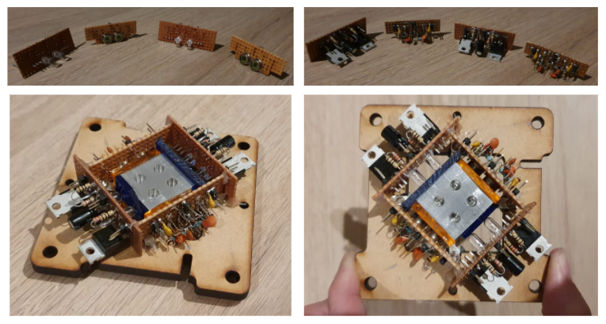

3. Para evitar que la luz LED interfiera en muestras adyacentes, se agrega un cobertor oscuro alrededor de los LEDs. Además se agregan cables a las salidas de las placas para facilitar futuras conexiones:
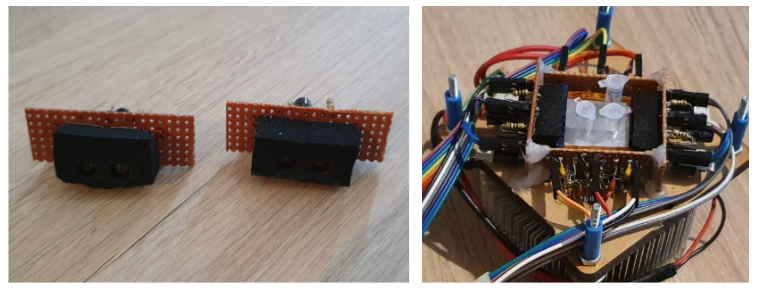

4. Se fabrica un elemento calentador con alambre de Nicrom. El elemento calentador, la peltier y el disipador se juntan como se muestra en la figura, se agrega pasta disipadora para mejor transferencia de calor. Estos elementos se adhieren al trozo de madera del bloque de aluminio como se muestra en la figura superior.
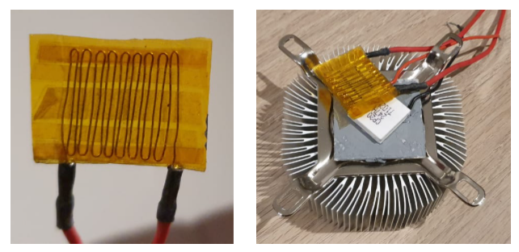

5. Se fija el sistema al encapsulado de madera de Ninja-PCR como se muestra en la siguiente figura:
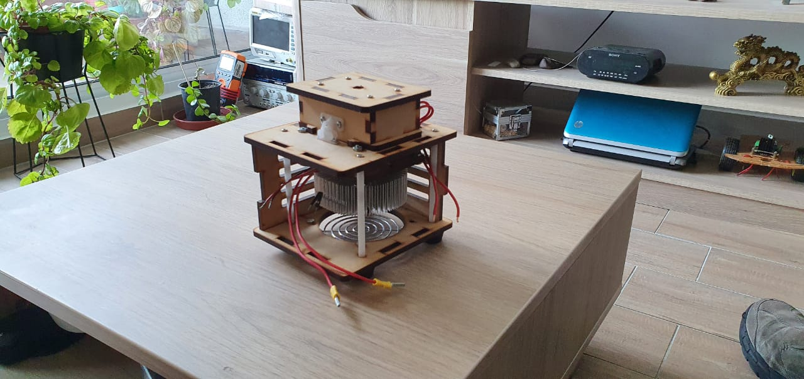

6. Se pone un elemento calentador de Nicrom (igual fabricación que el del paso 4) con un termistor y una lámina de cobre en la tapa del encapsulado para calentar las tapas de las muestras. También se agrega un termistor en el bloque de aluminio dentro de un tubo de ensayo.
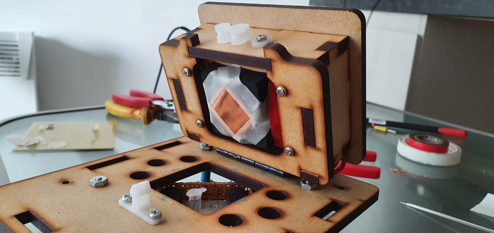

7. Se agregan los módulos electrónicos del microcontrolador, ADCs y el circuito que carga y estima el estado de carga de las baterías. También se agregan las baterías. Todo se conecta mediante cables y se introducen dentro del encapsulado.
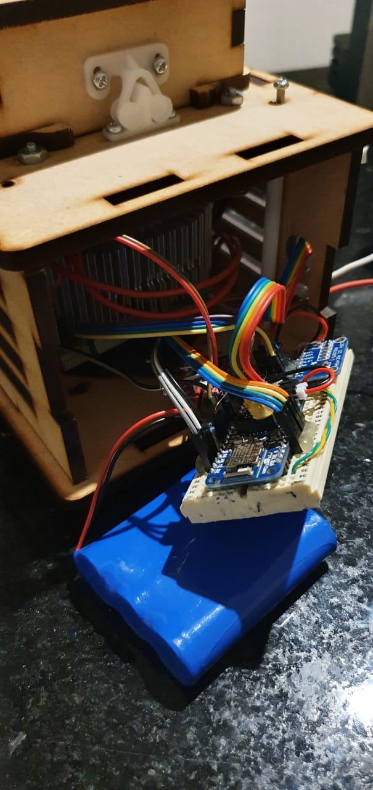

8. Finalmente el prototipo final se ve cómo se muestra a continuación:

---
## Diseño de Hardware Electrónico

A continuación se muestran los esquemáticos del diseño electrónico. En general, los componentes que son módulos fueron integrados mediante conexiones por cables, los componentes individuales fueron soldados a placas universales.

### Sistema de Alimentación y Microcontrolador

La alimentación externa a la fecha está pensada para que sean 5V y que pueda suministrar hasta 3A. La conexión con la batería está realizada, sin embargo no existe consumo de energía de ella. Para cargar y estimar el estado de carga de la Batería se utiliza el módulo Battery Babysitter de Sparkfun. El microcontrolador nRF 52840 corresponde a un módulo Feather de Adafruit.
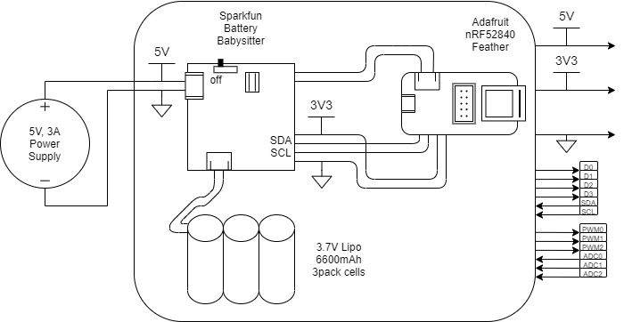

### Sistema de Emisión LED y Detección de Fluorescencia

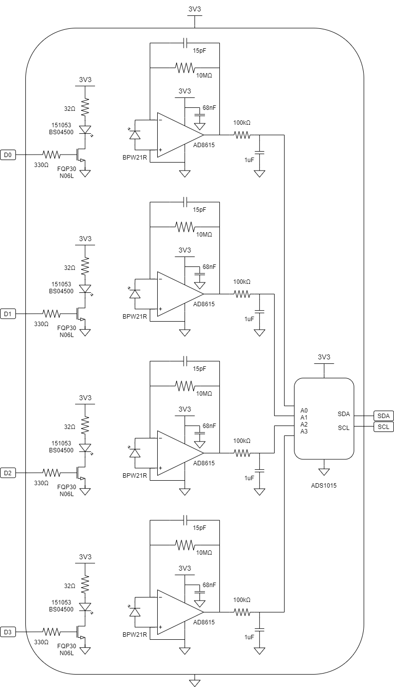
  
### Sistema de Control de Temperatura

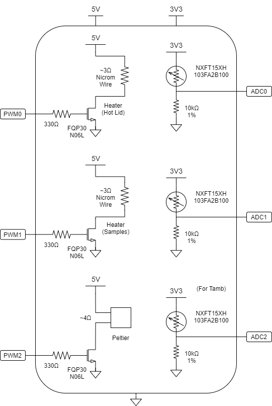

---
## Diseño del Software:

A continuación se muestra el diagrama de flujo del firmware del microcontrolador:
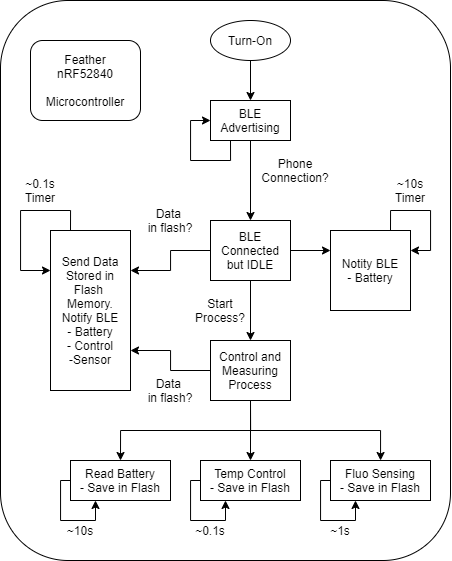

A continuación se muestra el diagrama de flujo de la aplicación de Android:
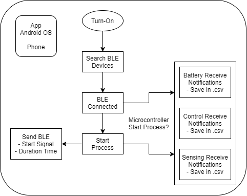
