# State of Progress

---
## Objectivo:

En este documento presenta los primeros resultados de algunos experimentos realizados con el prototipo, junto con algunas observaciones.

---
## Resultados de los experimentos:

A continuación se muestra un listado de los experimentos realizados con imágenes de los resultados que contienen información de la fluorescencia y temperatura.

Notar que en todos los casos la temperatura de referencia del bloque de aluminio es de 65°C y de la tapa caliente de unos 85°C.

Las pruebas se realizaron en dos días completos. En cada día las muestras se prapararon durante la mañana, se mantenían en una caja con hielo y se disponían en el prototipo 4 muestras por cada test.

En cada test, 3 de los tubos de ensayo contienen muestra positiva, mientras que el tubo restante es de control (muestra negativa). 

Adicionalmente a las reacciones hechas en el prototipo, en paralelo se realizaron reaciones (con la misma preparación de las muestras del día) en una máquina profesional (la cual sólo controla temperatura y no mide fluorescencia).

### Primer día de preparación de muestras:

#### Test 00 (muestra negativa en tubo 0):

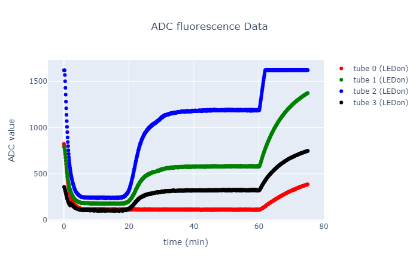

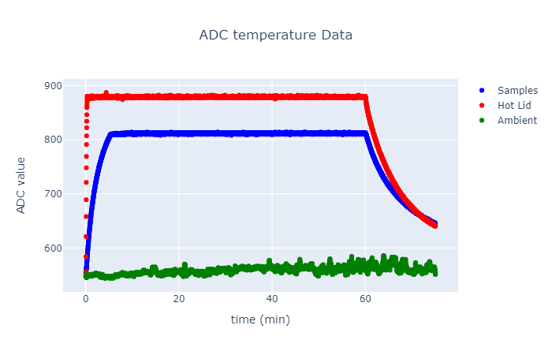

#### Test 01 (muestra negativa en tubo 2):

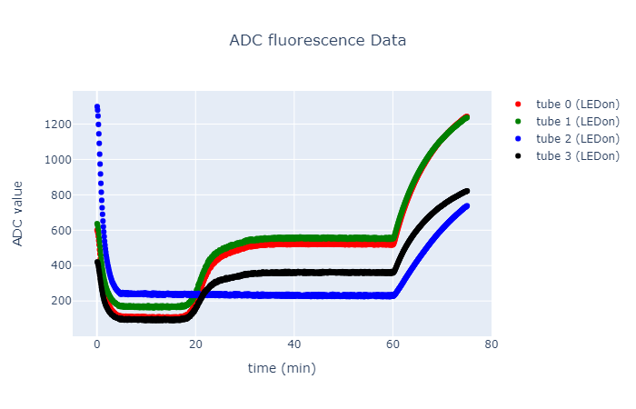

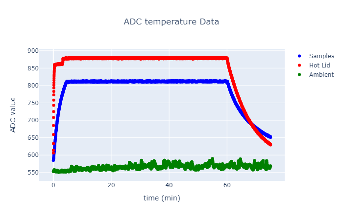

#### Test 02 (muestra negativa en tubo 1):

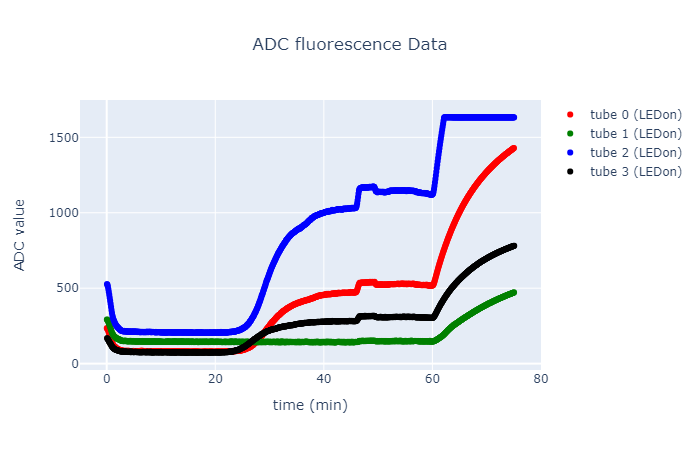

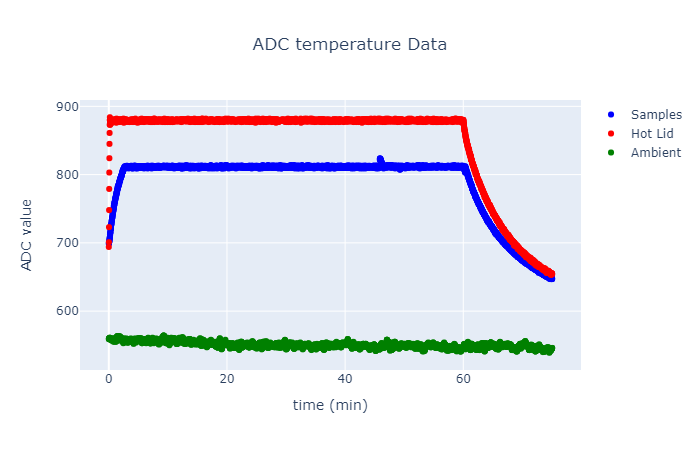

#### Test 03 (muestra negativa en tubo 3):

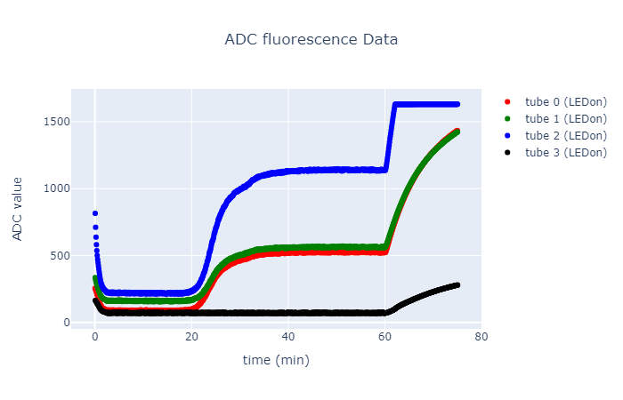

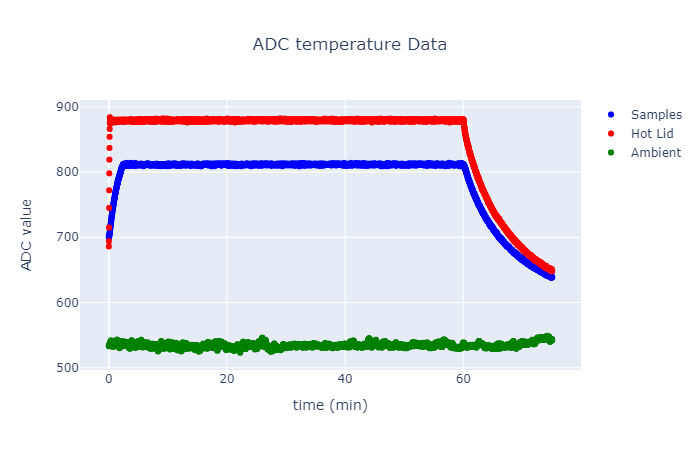

#### Medición de fluorescia en el prototipo de muestras cuyo control de temperatura fue realizado en máquina profesional

Primera tanda de muestras positivas:

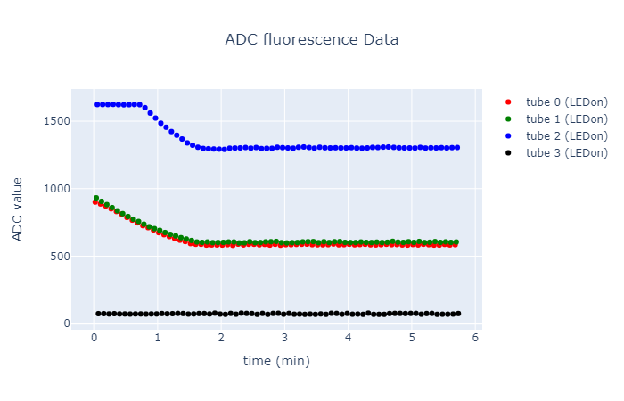

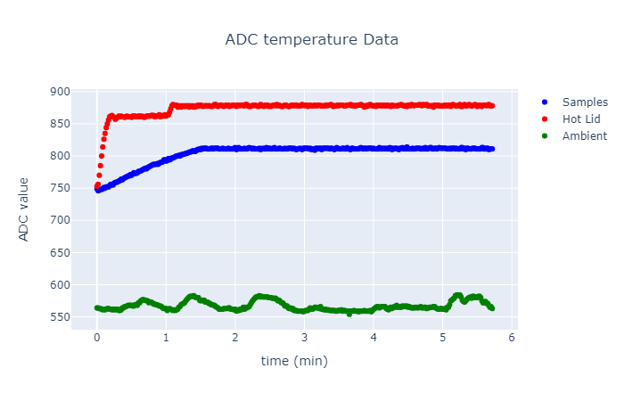

Segunda tanda de muestras positivas:

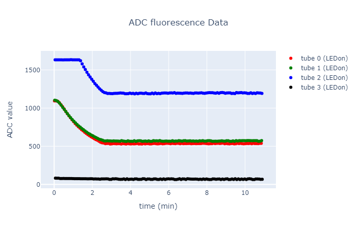

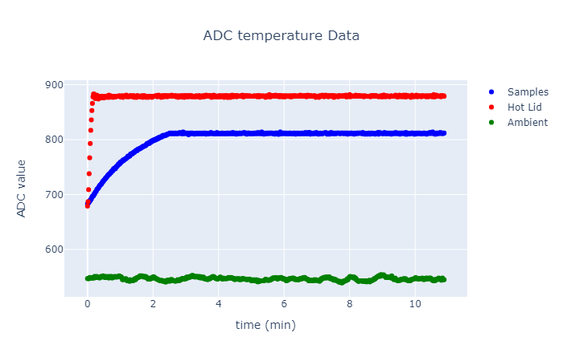

### Segundo día de preparación de muestras:

#### Test 05 (muestra negativa en tubo 0):

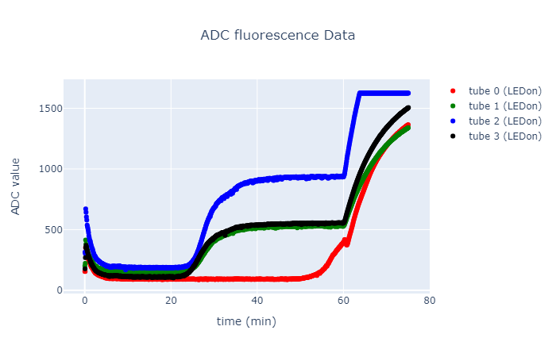

#### Test 06 (muestra negativa en tubo 1):

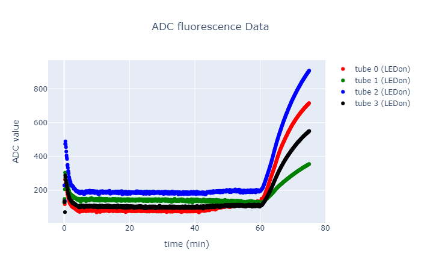

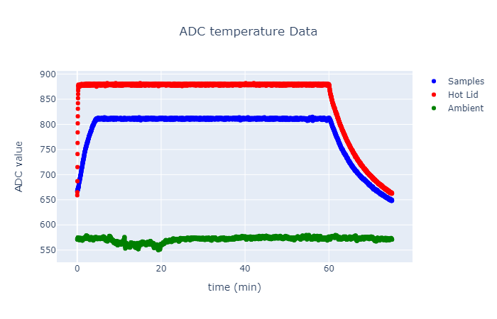

#### Test 07 (muestra negativa en tubo 2):

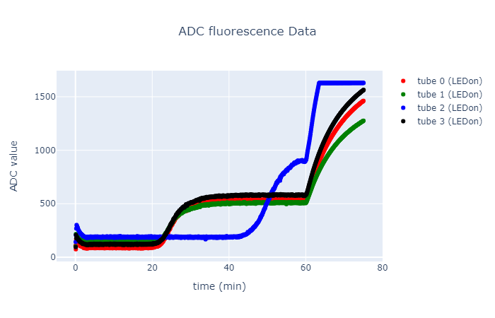

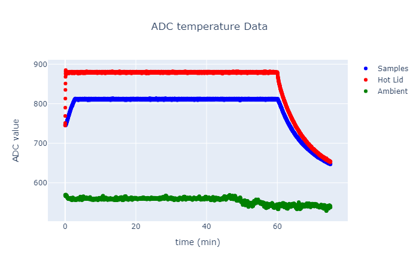

#### Test 08 (muestra negativa en tubo 3):

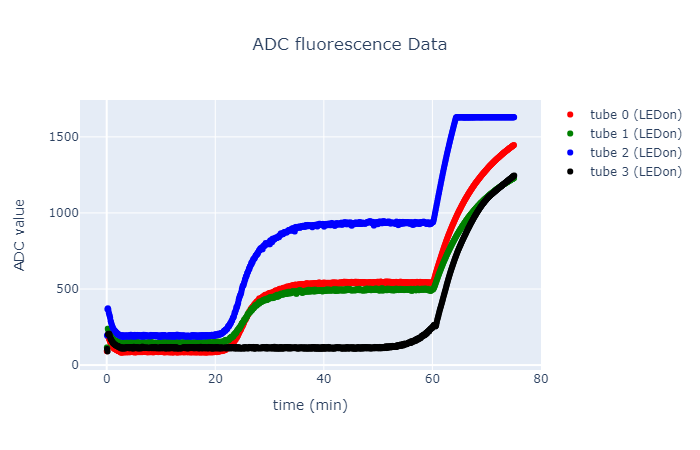

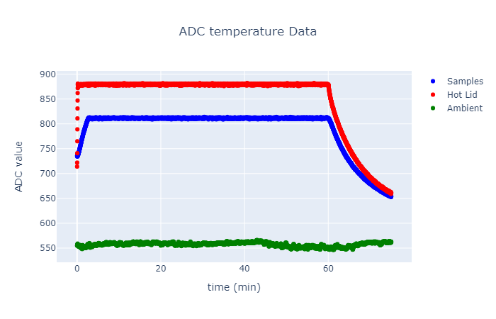

#### Test 09 (muestra negativa en tubo 1):

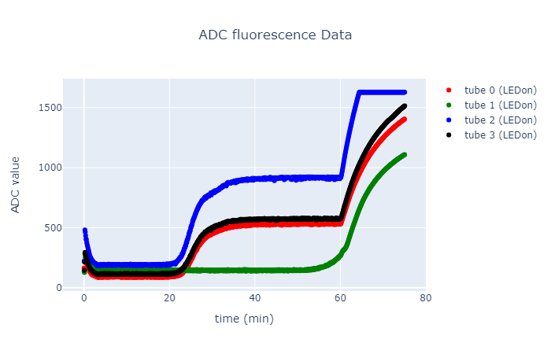

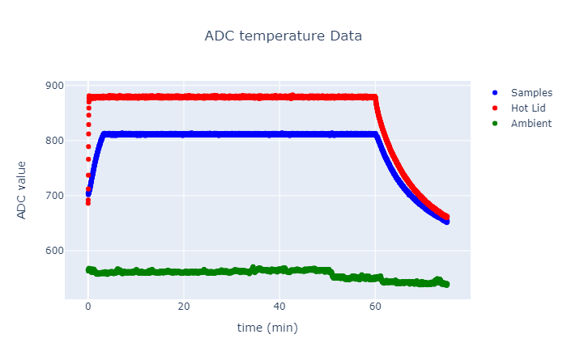

#### Medición de fluorescia en el prototipo de muestras cuyo control de temperatura fue realizado en máquina profesional

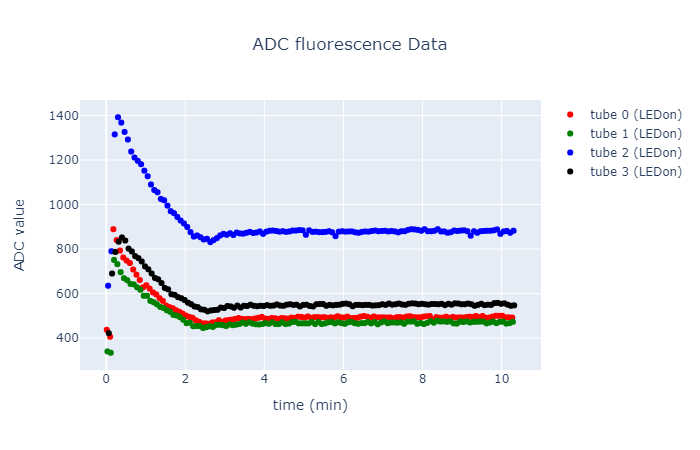

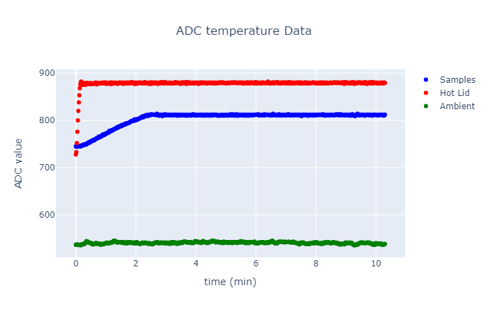

---
## Resumen de Resultados:

A continuación se muestran las mismas imágenes de la sección anterior pero presentadas de manera más compacta para una mejor comparación.

Notar que el "Test 06" no reaccionó y es por este motivo que no se presenta en las siguientes imágenes.

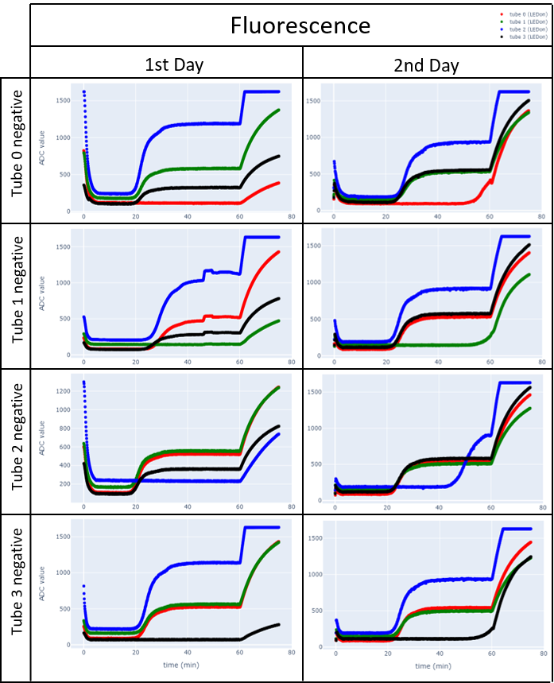

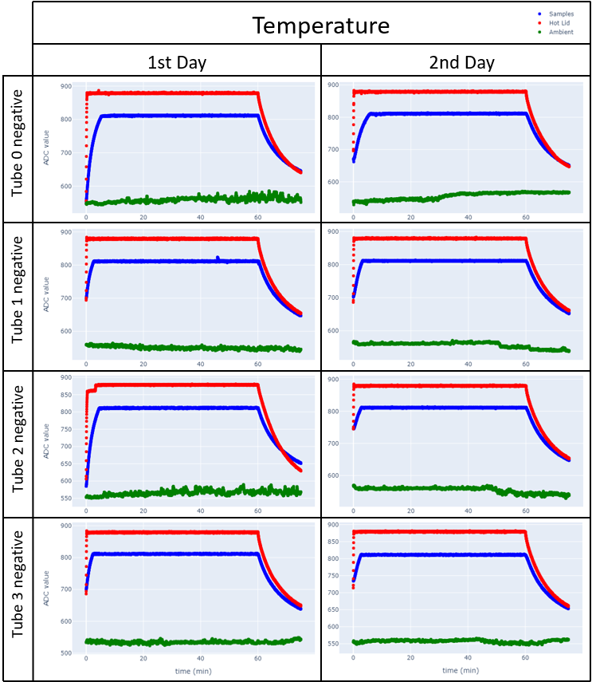

A continuación se muestran tablas resumen para comparar los valores de fluorescencia obtenidos por el prototipo y la máquina profesional:

|        | Prototype (test_00, test_01, test_02, test_03) | Professional* |
|--------|-----------------------------------------------:|-------------:|
|tube 0  |                        ~(   -, 520,  525,  525)|     585, 535 |
|tube 1  |                        ~( 585, 550,    -,  560)|     605, 575 |
|tube 2  |                       ~( 1195,   -, 1130, 1140)|   1300, 1200 |
|tube 3  |                        ~( 320, 360,  305,    -)|            - |
* here, were measured two different positive samples in the same tube position. Also, note that the tube 3 position was not measured.

|        | Prototype (test_05, test_09, test_07, test_08) | Professional |
|--------|-----------------------------------------------:|-------------:|
|tube 0  |                            ~( -, 530, 535, 545)|         ~500 |
|tube 1  |                            ~( 530, -, 510, 495)|         ~475 |
|tube 2  |                            ~( 935, 920, -, 930)|         ~880 |
|tube 3  |                            ~( 555, 575, 585, -)|         ~555 |

#### Observaciones:

Durante el primer día de pruebas, si bien se obtuvieron resultados consistentes, se puede ver el controlador de temperatura tiene algunos detalles que se pueden evidenciar en la figura 2da fila 1ra columna (pequeña falla en los ~50min) y en la figura 3ra fila 1 columna (falla al inicio).

Debido a estos problemas, antes del segundo día de pruebas se revisó y realizaron modificaciones para asegurar las conexiones del prototipo (en particular se cree que las conexiones a los "gates" de los mosfets que manipulan la temperatura no estaban bien aseguradas). En efecto, se puede ver que el control de temperatura el segundo día no tiene inconsistencias (incluso el sensor de temperatura ambiente no es tan ruidoso como el primer día).

Notar que la temperatura afecta la medición de fluorescencia, lo que se puede evidencias al inicio (primeros ~5min) y al final (después de los 60min). Esto no represente un problema severo para la detección de la curva sigmoidea dado que en esos momentos la temperatura es constante.

El primer día se ve que las muestras negativas no alcanzaron a reaccionar, mientras que el segundo día las muestras negativas reacionaron mucho después que lo hicieron las muestras positivas (lo cual es algo normal en reacciones LAMP). Esto puede deberse a que los colaboradoes que prepararon las muestras lo hicieron con diferentes insumos que el día anterior.

En general el aparato entrega resultados consistentes en el sentido de que las muestras positivas comienza un curva sigmoidea a los ~20min - ~25min y no hay reacción o tiene una reacción tardía para las muestras negativas.

En cuanto a la detección de fluorescencia, cada uno de los 4 circuitos entrega valores distintos de offset y ganancia. Se puede ver que los offsets son cercanos para los 4 circuitos, pero la ganancia para el circuito del tubo 2 es mayor (aproximadamente el doble) que los otros circuitos. Se aprecia que el primer día la ganancia del tubo 3 es considerablemente menor que la de los demás, mientras que el segundo día (luego de las reparaciones) se ve que los circuitos del tubo 0, 1 y 3 tienen ganancias similares.

De acuerdo con las tablas de comparación entre la máquina profesional y el prototipo, el control de temperatura del profesional y del prototipo genera valores cercanos de fluorescencia.
